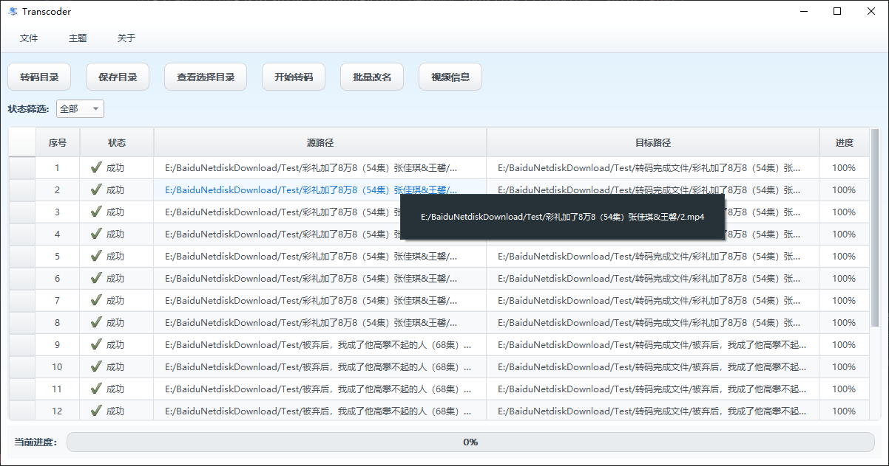
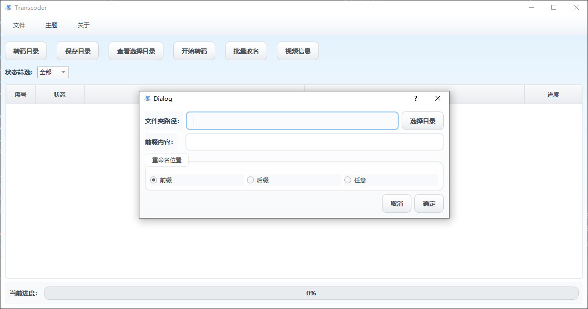
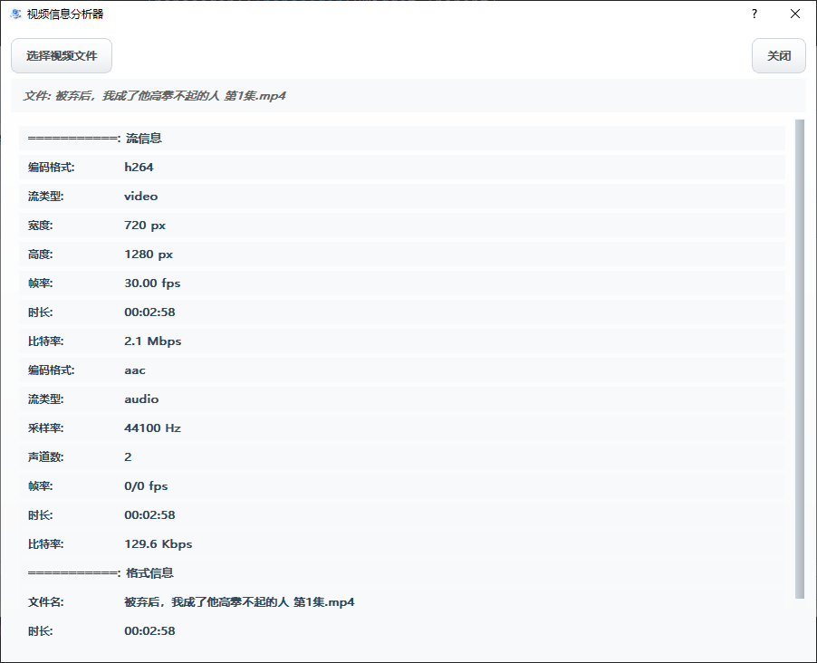
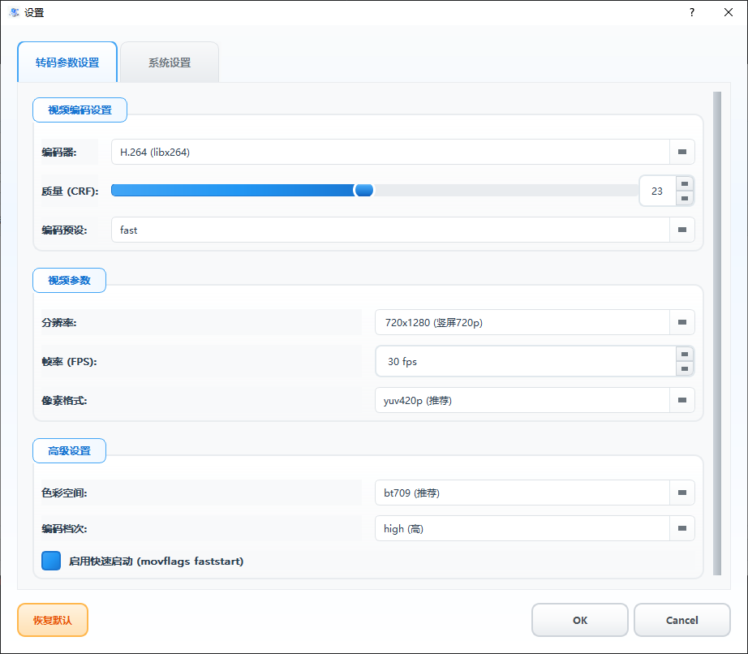

# Transcoder

[](https://opensource.org/licenses/MIT)
[](https://qt.io/)
[](https://ffmpeg.org/)
[](https://github.com/)
[](https://github.com/)

A powerful and user-friendly video transcoding application built with Qt and FFmpeg.

## Features

- **Batch Transcoding**: Process multiple video files in batch mode
- **Smart File Detection**: Automatically detect and skip already transcoded files
- **Progress Tracking**: Real-time progress monitoring with visual status indicators
- **Video Analysis**: Built-in video information analyzer using FFmpeg
- **Flexible Organization**: Organize output files by source directory structure
- **Modern UI**: Clean and intuitive interface with multiple theme support
- **Filter & Search**: Filter files by transcoding status
- **Multi-threading**: Concurrent processing for better performance

## Screenshots


*Main interface showing the transcoding queue with status indicators*


*Batch rename dialog*


*Video information analysis dialog*


*Transcoding settings configuration*

## System Requirements

- Windows 10/11
- Qt 5.15.2 or later
- FFmpeg installed and accessible in PATH

## Installation

1. Download the latest release from the releases page
2. Extract the archive to your desired location
3. Ensure FFmpeg is installed and accessible
4. Run `transcoder.exe`

## Usage

1. **Select Source Directories**: Click "选择转码目录" to choose folders containing video files
2. **Select Target Directory**: Click "选择保存目录" to set the output location
3. **Review Files**: The application will display all detected video files with their status
4. **Start Transcoding**: Click "开始转码" to begin the process
5. **Monitor Progress**: Track progress in real-time with the built-in progress indicators

## Building from Source

```bash
# Clone the repository
git clone <repository-url>
cd transcoder

# Build with qmake
qmake transcoder.pro
make

# Or use Qt Creator to open transcoder.pro
```

## Package Distribution

```bash
# Windows deployment
windeployqt transcoder.exe

# Or use the provided script
& 'D:\Qt\5.15.2\msvc2019_64\bin\windeployqt.exe' --release --compiler-runtime --dir 'dist' 'transcoder.exe'
```

## Technical Stack

- **Frontend**: Qt 5.15.2+ (C++)
- **Backend**: FFmpeg for video processing
- **UI Framework**: Qt Widgets with custom styling
- **Multi-threading**: QThread for concurrent processing
- **Configuration**: JSON-based configuration system

## Contributing

Welcome to submit issue reports and feature requests! If you want to contribute code to the project, please:

1. Fork this repository
2. Create your feature branch (`git checkout -b feature/AmazingFeature`)
3. Commit your changes (`git commit -m 'Add some AmazingFeature'`)
4. Push to the branch (`git push origin feature/AmazingFeature`)
5. Open a Pull Request

## License

This project is licensed under the MIT License - see the LICENSE file for details.